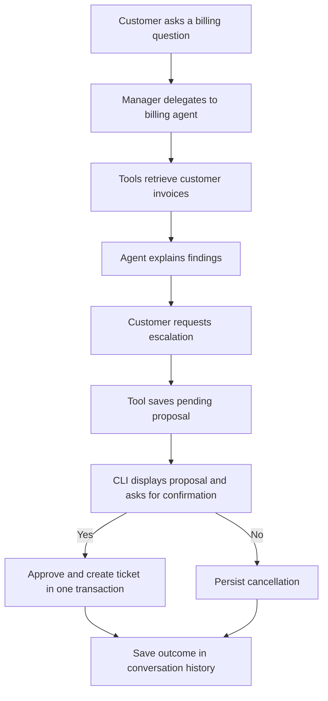

# Azure AI Agent Server Side

A Python customer-support assistant for a fictional Contoso Corporation, using Azure AI Foundry agents and Microsoft Agent Framework's Magentic orchestration. The interactive terminal chat combines policy guidance with customer-scoped invoice lookups and support-ticket creation after explicit user confirmation. Billing data is synthetic and stored locally in SQLite.

## Current capabilities

| Capability | Implementation |
| --- | --- |
| Multi-agent coordination | A manager routes requests and coordinates three specialist agents. |
| Billing guidance | Answers billing policy questions and retrieves customer invoices through tools. |
| Agent function tools | Four billing tools have explicit names, descriptions, and typed parameter metadata. |
| Human approval | Confirmation accepts `y`/`yes`, cancellation accepts `n`/`no`/Enter, and invalid input prompts again. |
| Ticket status | Billing retrieves customer-owned ticket status through `get_support_ticket_status`. |
| Persistent data | SQLite stores customers, invoices, proposals, and tickets; a separate command populates synthetic records. |
| Customer and session boundaries | Application-bound identities scope invoice access and proposal review. |
| Retry-safe ticket creation | A transaction and unique proposal reference prevent duplicate tickets for the same proposal. |
| Customer support | Provides account-access guidance, policy clarification, and escalation guidance. |
| Technical support | Provides API-latency troubleshooting and incident-triage guidance. |
| Local knowledge | Markdown documents are embedded in each specialist's instructions when its agent version is created. |
| Conversational context | Keeps accepted turns in `AgentSession` memory and includes them as context in each new task. |
| Optional text moderation | Azure AI Content Safety checks user messages before execution and final responses before display. |
| Agent configuration | Agent names, descriptions, model deployment names, and temperatures are configured in YAML. |
| Explicit agent deployment | `deploy.py` creates agent versions; `main.py` connects to the deployed agents for chat. |
| Infrastructure templates | Bicep and Make targets support provisioning the Azure resources. |

## How it works

1. Run `python deploy.py` explicitly to load configuration and create a new Foundry agent version for the manager and each specialist. Specialist instructions include their local Markdown knowledge.
2. Start `python main.py` to load `.env` and `config/config.yaml`, then authenticate with `DefaultAzureCredential`.
3. Check that the separately populated `storage/demo.sqlite3` is ready, select demo customer (e.g.`CUS-001`), and generate a new session UUID. Connect runtime agents to Foundry and give the billing specialist tools bound to those IDs.
4. Create a conversation history service for the CLI run. For each non-empty message, optionally moderate the input and combine it with prior accepted turns into one task message.
5. Build a fresh Magentic workflow for the task. The manager coordinates the support, billing, and technical agents.
6. Optionally moderate the final response and print the accepted answer.
7. Retrieve pending proposals for the current customer and session. The CLI displays each accepted proposal and asks for confirmation, then creates a ticket or saves cancellation.
8. Add the user message, agent answer, and application confirmation outcomes to conversation history.

The workflow sets `max_round_count=5`, `max_stall_count=3`, and `max_reset_count=2`. Responses are requested with `stream=False`.

The deployed manager instructions and local [prompts/magentic.py](prompts/magentic.py) define JSON progress reporting and completion of the current conversation turn. Once a specialist prepares a necessary clarification question or saves a pending proposal, the workflow should return control to the CLI rather than wait for user input internally. Local final-answer instructions distinguish finishing a turn from resolving the underlying issue.

The workflow uses the framework's `StandardMagenticManager` with the local progress and final-answer prompts. Routing and completion decisions follow those prompts without a local decision override.

### Prompt responsibilities

| Location | Responsibility |
| --- | --- |
| `config/config.yaml` descriptions | Specialist capabilities and ownership; shared by deployment and runtime and included in the manager's team context. |
| `prompts/manager.py` | General coordination, routing by declared capabilities, and evidence boundaries. |
| `prompts/magentic.py` | Domain-independent progress evaluation, turn completion, JSON schema, and final-answer formatting. |
| Specialist prompts, such as `prompts/billing.py` | Domain policies, tool selection, required inputs, and action limits. |
| `tools/billing_tools.py` | Executable function implementations and their input metadata. |

The progress prompt uses the framework's `{team}` context rather than maintaining
a separate list of billing tools or ticket-routing examples. Deploy changed
manager or specialist instructions with `python deploy.py`; restart the CLI to
load local workflow prompts and configured capability descriptions.

### Agent responsibilities

| Component | Responsibility |
| --- | --- |
| Manager | Routes work, evaluates progress, and synthesizes the final response. |
| Billing | Invoice lookups, invoice-related ticket proposals, and existing ticket-status lookups. Owns all four local tools. |
| Support | General account-access and customer guidance; has no invoice or ticket-management tools. |
| Technical | Troubleshooting and incident guidance. |
| Application CLI | Reviews pending proposals, requests confirmation, and calls ticket creation or proposal cancellation. |

Support-ticket requests are routed to Billing even though their wording includes “support.” Status lookup needs only a ticket ID. Preparing a new proposal requires an owned invoice and a non-empty issue. General tickets without an invoice, cancellation of an existing ticket, and ticket-status updates are not implemented.

## Run locally

You need Python with support for the dependencies in `requirements.txt`, an Azure AI Foundry project, and a model deployment matching the configuration. The repository's local development environment uses Python 3.13.

The deployment identity needs permission to create agent versions in the project. The runtime identity needs permission to use the deployed agents and, if moderation is enabled, analyse text with the Content Safety resource.

### 1. Install dependencies

From the repository root:

```bash
python3 -m venv .venv
source .venv/bin/activate
python -m pip install -r requirements.txt
python -m pip install python-dotenv agent-framework-orchestrations
```

### 2. Configure endpoints and authentication

```bash
cp .env.example .env
az login
```

Edit `.env` with your resource endpoints:

| Variable | Required | Purpose |
| --- | --- | --- |
| `AZURE_PROJECT_ENDPOINT` | Yes | The actual project endpoint from your Foundry project. |
| `CONTENT_SAFETY_ENDPOINT` | No | Endpoint of the Azure AI Content Safety resource. Omit it or leave it empty to disable moderation. |

Authentication uses the shared `DefaultAzureCredential` in `clients/foundry.py`.

### 3. Check agent configuration

Edit [config/config.yaml](config/config.yaml) so each agent's `model` matches an available model deployment in your project. All four agents currently use `gpt-5.1`. The manager temperature is `0.3`; specialist temperatures are `0.5`.

### 4. Deploy the agents

```bash
python deploy.py
```

Run this once before starting the chat, and again when publishing changes to deployed agent instructions, local knowledge documents, models, or tool schemas. Each invocation creates new versions of all four agents, including agents that already exist. It requires an existing Foundry project and model deployments.

Changes to `prompts/magentic.py`, runtime descriptions, logging, or local service implementations take effect after restarting the CLI. New or changed model-visible tool declarations also require `python deploy.py`. Editing synthetic data requires the separate population command; it does not require an agent deployment.

Deployment stops on the first error and exits unsuccessfully. Any versions already created remain in Azure; rerunning creates new versions again.

### 5. Start the chat

Populate the local database separately before the first chat:

```bash
python -m storage.seed
```

The editable dataset is [storage/synthetic_data.json](storage/synthetic_data.json).
Run the population command again after adding records; existing IDs are preserved.

```bash
python main.py
```

Normal startup connects to agents by their configured names and checks that the local billing database is ready. It does not populate or migrate data. Use the same project endpoint and agent names for deployment and runtime. The CLI uses synthetic customer `CUS-001`; it does not authenticate an end customer.

Example requests:

```text
You: What is the policy for changing my subscription?
You: I cannot access my account. What should I check?
You: Our API latency increased after a deployment. How should we triage it?
```

Enter `exit`, `quit`, or `bye` to end the session.

## Billing tools and ticket workflow

[tools/billing_tools.py](tools/billing_tools.py) creates Microsoft Agent Framework
function tools using `@tool` metadata and `Annotated` parameter descriptions.
Deployment converts the same metadata into Azure SDK `FunctionTool` declarations
and stores them in the billing agent's `PromptAgentDefinition`. Named Foundry
agents must have these schemas in the service: supplying runtime tools alone
only enables local dispatch and does not advertise tools to the model.

At runtime the billing agent receives the Python implementations, bound to the
current customer and session. They run locally and call the service layer to
access SQLite. No customer/session bindings are included in deployed schemas.

`create_billing_tool_definitions()` creates schema-only tool objects to reuse
their metadata. The placeholder identities are not executed or serialized.
Declarations use `strict=True` and `additionalProperties=False`; actual
functions are bound to the current customer and session at runtime.

| Agent tool | Model-supplied inputs | Result |
| --- | --- | --- |
| `list_my_invoices` | None | Current customer's invoices, including amounts in cents and currency. |
| `get_invoice_details` | `invoice_id` | An owned invoice, or `None` if missing or unavailable to this customer. |
| `prepare_support_ticket` | `invoice_id`, `issue` | A persisted pending proposal; no ticket is created yet. |
| `get_support_ticket_status` | `ticket_id` | An owned ticket's current status and details, or `None` if unavailable. |

The application supplies `customer_id`, `session_id`, and the database path when
creating tools. These values are absent from the model's input schema. The same
agent instances and session identity are reused across messages in one CLI run.



### Local storage

[storage/database.py](storage/database.py) defines the schema and connections.
The four tables are `customers`, `invoices`, `ticket_proposals`, and
`support_tickets`. Monetary values use integer cents; billing periods use fixed
`YYYY-MM` strings. The dataset includes ten customers, fifty invoices, and twelve
tickets covering paid, unpaid, refunded, and possible duplicate
charges. See [scenario details](storage/README.md).

Population is independent of the chat and Azure. It inserts missing records
without overwriting existing data:

```bash
python -m storage.seed
python -m storage.seed --data storage/synthetic_data.json --database /tmp/demo.sqlite3
```

The default file is `storage/demo.sqlite3` and is ignored by Git. The population
command upgrades existing schemas to include proposal references and cancellation; older
uncompleted `approved` proposals become `pending` and require confirmation again.

Reruns preserve existing records by ID, including edited ticket statuses and
user-created tickets. They do not update or delete records when the JSON changes.
Dataset counts describe the JSON file; an existing database can contain additional
records. `--database` changes only the population destination; the chat still uses
`storage/demo.sqlite3`. Python callers must pass both paths:

```python
from storage.database import DEFAULT_DATABASE_PATH
from storage.seed import DEFAULT_DATA_PATH, seed_database

inserted = seed_database(DEFAULT_DATABASE_PATH, DEFAULT_DATA_PATH)
```

## Conversation history

[ConversationService](services/conversation_service.py) creates an `AgentSession` for each CLI run and stores user and assistant `Message` objects under `session.state["conversation_history"]["messages"]`.

For a follow-up request, `build_task()` formats the accumulated history as context and appends the current request. That single task message is passed to a fresh Magentic workflow. Conversation history lives in memory for the duration of the CLI run.

After a successful response passes the configured moderation checks, `add_turn()` appends the user message and the final answer together with ticket-review outcomes. This lets follow-up turns see ticket IDs or cancellations performed by the application. Chat history is in memory; invoices, proposals, and tickets persist in SQLite.


## Content Safety behavior

When `CONTENT_SAFETY_ENDPOINT` is configured, the application blocks text if any returned category has severity greater than `2`.

- Blocked user input is rejected before workflow execution.
- A blocked final response is replaced with a notice instead of being displayed. The workflow has already run at that point.
- Ticket proposal summaries are checked before display. A blocked proposal is cancelled without creating a ticket.
- If the endpoint is missing, the CLI prints a notice and continues without moderation.

## Azure infrastructure

[infra/main.bicep](infra/main.bicep) defines a Foundry account and project, `gpt-5.1` and `gpt-4.1` model deployments, and an Azure AI Content Safety resource. Both model deployments use `GlobalStandard` with capacity `1`. The default application configuration only uses `gpt-5.1`.

The [Makefile](Makefile) provides these commands:

| Command | Action |
| --- | --- |
| `make group` | Create the configured resource group. |
| `make validate` | Validate the infrastructure deployment against Azure. |
| `make what-if` | Preview infrastructure changes. |
| `make deploy` | Create the resource group, upgrade Bicep, and deploy resources. |
| `make outputs` | Show deployment outputs. |
| `make list` | List resource groups in the subscription. |
| `make deleted` | List soft-deleted Cognitive Services accounts. |
| `make cleanup` | Delete the configured resource group and all its resources. |
| `make purge` | Permanently purge the accounts named in that target. |

Review the Makefile defaults before running commands. Variables can be overridden, for example:

```bash
make what-if RESOURCE_GROUP=my-resource-group AI_FOUNDRY_NAME=my-foundry
```

Deployment requires an appropriate region, model availability, quota, and Azure permissions. The outputs include `OPENAI_ENDPOINT`, model deployment names, and `CONTENT_SAFETY_ENDPOINT`. Obtain `AZURE_PROJECT_ENDPOINT` from your Foundry project for the application's `.env` configuration.


## Project layout

```text
main.py                       Terminal chat and startup
deploy.py                     Explicit agent deployment command
agents/deployment/            Foundry agent version creation
agents/runtime/               Runtime Foundry agent clients
clients/foundry.py            Shared Azure credential and project client
config/                       YAML configuration and loader
data/                         Specialist reference documents and loader
infra/                        Azure Bicep templates
orchestration/                Magentic workflow construction
prompts/                      Agent personas and instructions
services/content_safety_service.py  Text moderation
services/conversation_service.py    In-memory session history and task context
services/billing_service.py         Customer-scoped invoice queries
services/ticket_service.py          Proposal storage, approval, creation, cancellation
services/ticket_confirmation.py     CLI confirmation and outcome reporting
tools/billing_tools.py              Agent tool metadata and session-bound wrappers
storage/database.py                SQLite schema, connections, and migrations
storage/seed.py                    Explicit, repeatable JSON-to-SQLite population
storage/synthetic_data.json        Editable synthetic customers, invoices, and tickets
Makefile                      Azure infrastructure commands
```

## License

[MIT](LICENSE).
